# Temat pracy magisterskiej: Zastosowanie modeli dyfuzyjnych do stabilizacji wykresów funkcji
**Autorka**: Klaudia Stodółkiewicz

**Promotor**: dr inż. Tomasz Służalec

Repozytorium stanowi część pracy magisterskiej poświęconej zastosowaniu modeli dyfuzyjnych do analizy, generacji oraz rekonstrukcji wykresów funkcji jednowymiarowych.

## Cel
Celem pracy magisterskiej jest szczegółowa analiza wpływu parametrów w modelach dyfuzyjnych na proces stabilizacji wykresów wybranych funkcji. 
W niniejszym repozytorium skupiono się na badaniu, w jaki sposób zmiana parametrów modelu - takich jak współczynnik dyfuzji, liczba iteracji czy metoda inicjalizacji procesu - wpływa na stabilność oraz dokładność uzyskiwanych wyników. Celem analizy jest sprawdzenie, czy istnieją optymalne zestawy parametrów prowadzących do redukcji szumów i poprawy precyzji odtwarzania funkcji, a co za tym idzie, stwierdzenie, czy modele dyfuzyjne (DDPM) oraz metody oparte o warunkowanie (SDEdit, FunDPS) są w stanie skutecznie rekonstruować zaszumione wykresy funkcji jednowymiarowych.

## Podstawy teoretyczne

### Modele dyfuzyjne (DDPM)

Denoising Diffusion Probabilistic Models (DDPM) to generatywne modele probabilistyczne, które uczą się rozkładu danych poprzez proces stopniowego dodawania szumu (proces forward - wykres 1) oraz jego odwracania (proces reverse - wykres 2) - sieć neuronowa uczy się usuwać szum i odzyskiwać oryginalny sygnał/wykres funkcji.
Model uczy się przybliżenia rozkładu danych poprzez minimalizację błędu rekonstrukcji szumu.

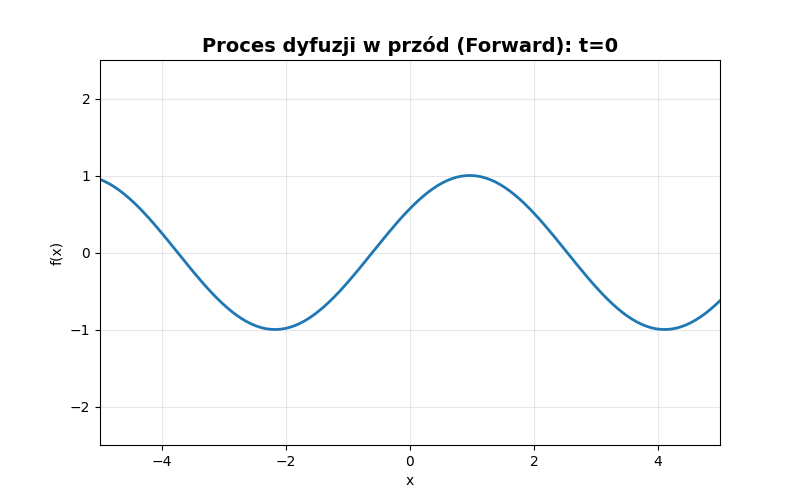

### SDEdit

SDEdit to metoda wykorzystująca modele dyfuzyjne do edycji oraz rekonstrukcji danych poprzez częściowe zaszumienie sygnału wejściowego/oryginalnej funkcji matematycznej i ich ponowne odtworzenie.

Charakterystyka:
* kontrolowany poziom degradacji danych,
* rekonstrukcja zgodna z wyuczonym rozkładem,
* zastosowanie w odszumianiu i inpaintingu.

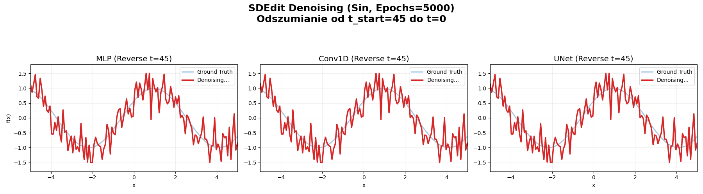


### FunDPS

FunDPS (Function Diffusion Posterior Sampling) to metoda rozwiązująca problemy odwrotne poprzez warunkowanie procesu dyfuzyjnego.

Model optymalizuje:

* **prior** - wiedzę o rozkładzie funkcji,
* **likelihood** - zgodność z obserwacjami.

Tę metodę stosuje się głównie w rekonstrukcji funkcji z rzadkich próbek, inpaintingu oraz interpolacji.


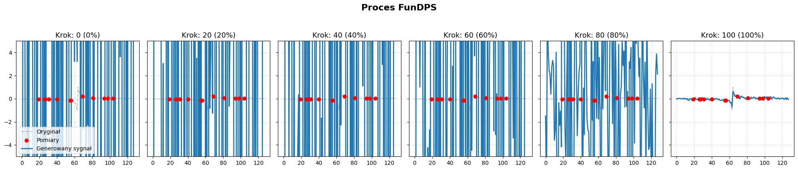


## Rodzaje szumu

W eksperymentach wykorzystano dwa główne typy szumu:

### White Noise

* nieskorelowany szum Gaussowski,
* każda próbka niezależna,
* stosowany jako podstawowy model zakłóceń.

### Gaussian Random Field (GRF)

* szum skorelowany przestrzennie,
* modeluje realistyczne zakłócenia,
* generowany z wykorzystaniem funkcji kowariancji.

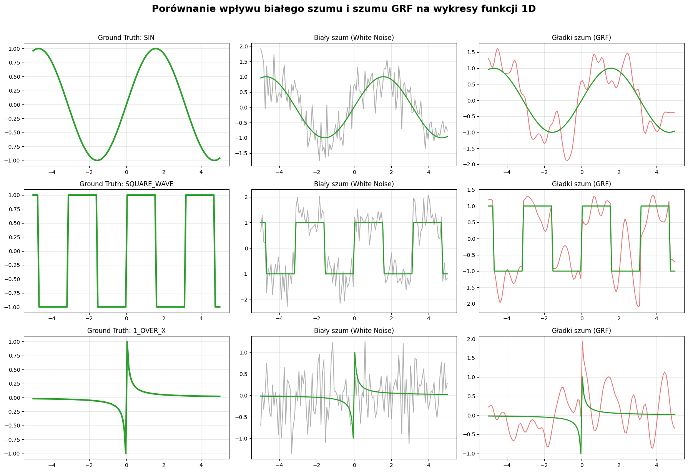


## Hiperparametry

Najważniejsze parametry wpływające na działanie modeli:

* **liczba kroków dyfuzji** - wpływa na dokładność i czas działania,
* **poziom szumu (noise level)** - kontroluje degradację sygnału,
* **zeta (ζ)** - siła warunkowania w FunDPS,
* **architektura modelu** - MLP / Conv1D / U-Net,
* **learning rate** - wpływa na proces uczenia.


## Eksperymenty

### 1. Generacja bezwarunkowa

`1. eksperyment_generacja_bezwarunkowa.ipynb`

* generacja funkcji 1D z DDPM,
* porównanie architektur: MLP, Conv1D, U-Net,
* analiza overfittingu i capacity modeli.


### 2. Odszumianie – SDEdit

`2. eksperyment_odszumianie_sdedit.ipynb`

* rekonstrukcja zaszumionych sygnałów,
* analiza odporności modeli,
* wykorzystanie DDPM + SDEdit.


### 3. Rekonstrukcja warunkowa – FunDPS

`3. eksperyment_fundps.ipynb`

* rekonstrukcja funkcji z niepełnych danych,
* analiza problemów odwrotnych,
* badanie wpływu:

  * rodzaju szumu (White vs GRF),
  * parametrów warunkowania.


### 4. Porównanie metod

`4. eksperyment_ddpm_vs_fundps`

Wyniki wskazują, że:

* FunDPS znacząco przewyższa DDPM w zadaniach rekonstrukcji,
* U-Net jest najlepszą architekturą wśród modeli DDPM,
* modele MLP i Conv1D mają ograniczoną zdolność generalizacji.


## Wizualizacje

Pliki:

* `0. wizualizacje_wplywu_parametrow_i_odszumiania.ipynb`
* `tworzenie_wizualizacji.ipynb`

Zawierają:

* wpływ parametrów na proces dyfuzji,
* wizualizacje odszumiania,
* przykłady działania modeli.


## Struktura repozytorium

```
.
├── ddpm1d/
│   ├── ddpm1d_mlp.py
│   ├── ddpm1d_conv1d.py
│   └── ddpm1d_unet.py
│
├── edm1d/
│   └── edmdenoiser1d.py
│
├── utils/
│   ├── math_functions.py
│   ├── metrics.py
│   └── plot.py
│
├── notebooks/
│   ├── 0. wizualizacje_wplywu_parametrow_i_odszumiania.ipynb
│   ├── 1. eksperyment_generacja_bezwarunkowa.ipynb
│   ├── 2. eksperyment_odszumianie_sdedit.ipynb
│   ├── 3. eksperyment_fundps.ipynb
│   ├── 4. eksperyment_ddpm_vs_fundps
│   └── tworzenie_wizualizacji.ipynb
```


## Metryki

* **L2 Error** - podstawowa miara błędu rekonstrukcji,
* **MSE** - średni błąd kwadratowy,
* **czas wykonania** - wydajność obliczeniowa.


## Wnioski

* Modele dyfuzyjne skutecznie modelują rozkłady funkcji 1D,
* SDEdit umożliwia efektywne odszumianie,
* FunDPS jest najbardziej efektywną metodą w zadaniach rekonstrukcji,
* struktura szumu ma istotny wpływ na jakość wyników.


## Technologie

* Python
* PyTorch
* NumPy
* Matplotlib


## Uwagi

Repozytorium ma charakter badawczy i stanowi część pracy magisterskiej. Kod oraz eksperymenty zostały przygotowane w celach naukowych i eksperymentalnych.


## Instalacja i uruchomienie

```bash
git clone <REPO_URL>
cd <REPO_NAME>
pip install -r requirements.txt
```

### Uruchamianie środowiska

```bash
jupyter notebook
```


## Reprodukowalność wyników

1. **Trenowanie modeli (DDPM):**
   `1. eksperyment_generacja_bezwarunkowa.ipynb`

2. **Odszumianie (SDEdit):**
   `2. eksperyment_odszumianie_sdedit.ipynb`

3. **Rekonstrukcja warunkowa (FunDPS):**
   `3. eksperyment_fundps.ipynb`

4. **Porównanie metod:**
   `4. eksperyment_ddpm_vs_fundps`

5. **Wizualizacje:**
   `0. wizualizacje_wplywu_parametrow_i_odszumiania.ipynb`
   `tworzenie_wizualizacji.ipynb`


## Dane

Dane wykorzystywane w eksperymentach są **syntetyczne** i generowane dynamicznie.

* źródło: `utils/math_functions.py`
* typy funkcji:
  * wielomiany
  * funkcje trygonometryczne
  * funkcje wykładnicze i logarytmiczne
  * sygnały niestacjonarne (np. chirp)

### Przetwarzanie:
* normalizacja do wspólnego zakresu
* próbkowanie do stałej liczby punktów
* dodanie szumu (White / GRF)

## Podstawy matematyczne

### Proces dyfuzji (forward)

```math
q(x_t | x_{t-1}) = \mathcal{N}(x_t; \sqrt{1 - \beta_t} x_{t-1}, \beta_t I)
```

### Proces odwrotny (reverse)

```math
p_\theta(x_{t-1} | x_t)
```

### Funkcja straty

```math
\mathbb{E}_{x_0, \epsilon, t} \left[ || \epsilon - \epsilon_\theta(x_t, t) ||^2 \right]
```

### FunDPS (posterior sampling)

```math
\log p(x|y) \propto \log p(x) + \log p(y|x)
```

## Przykłady wyników

### DDPM vs. FunDPS
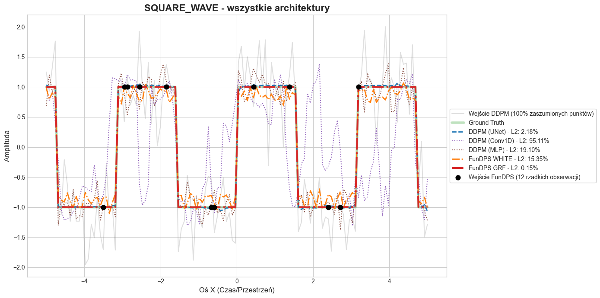

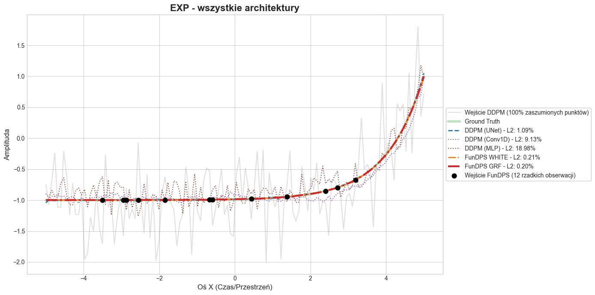

Porównanie:

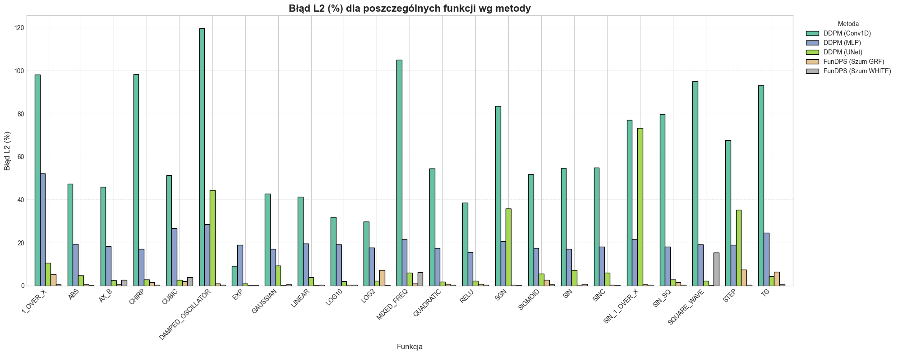

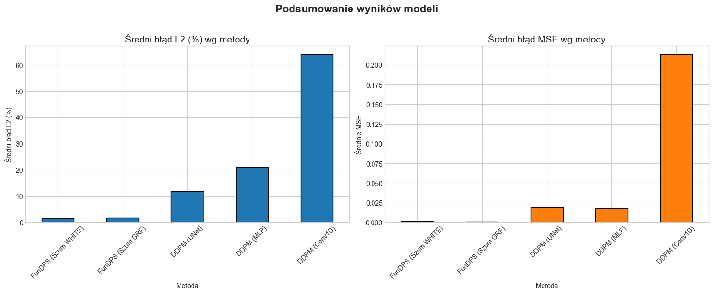


### SDEdit vs. FunDPS
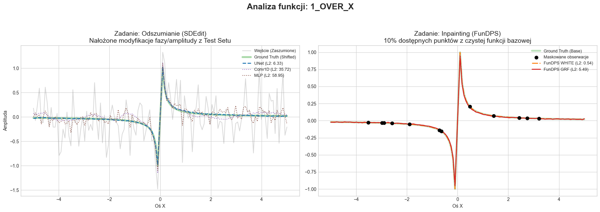

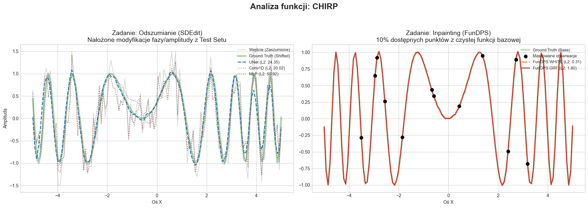

Porównanie:

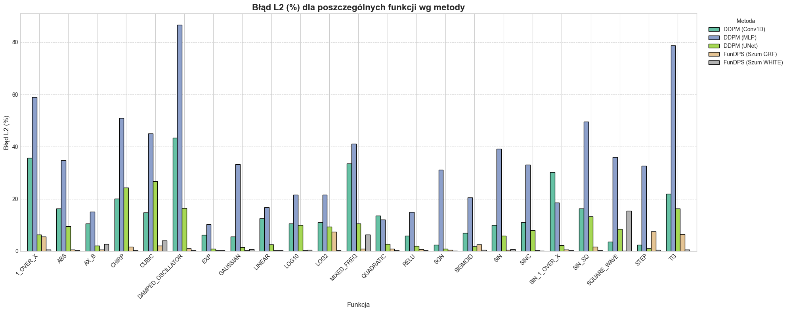

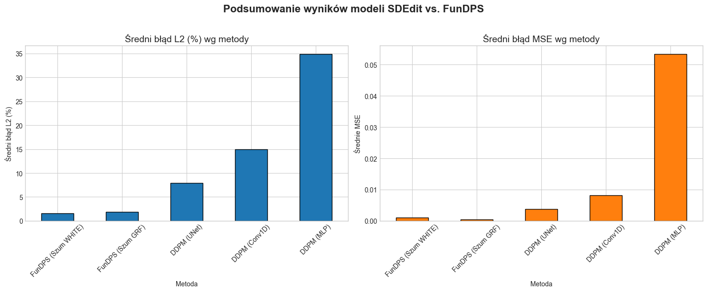


## Ograniczenia

* modele trenowane na danych syntetycznych,
* ograniczona liczba architektur,
* brak testów na danych rzeczywistych,
* wysokie koszty obliczeniowe dla U-Net.


## Możliwe rozszerzenia

* zastosowanie do danych rzeczywistych (np. pomiary fizyczne),
* rozszerzenie na funkcje 2D,
* wykorzystanie nowszych modeli (np. EDM, score-based models),
* optymalizacja czasu inferencji.


## Autorka

Klaudia Stodółkiewicz

*Zastosowanie modeli dyfuzyjnych do stabilizacji wykresów funkcji*

Informatyka - Data Science | Akademia Górniczo-Hutnicza im. Stanisława Staszica w Krakowie

2026


