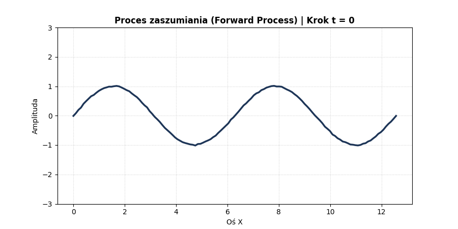
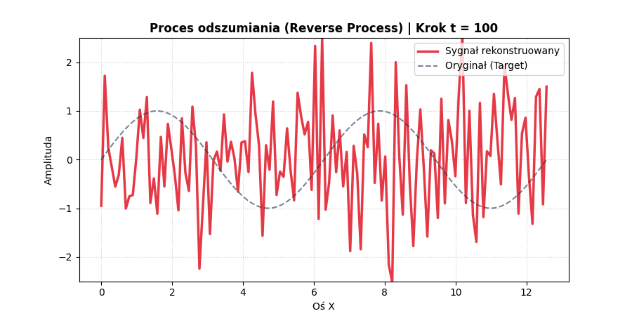
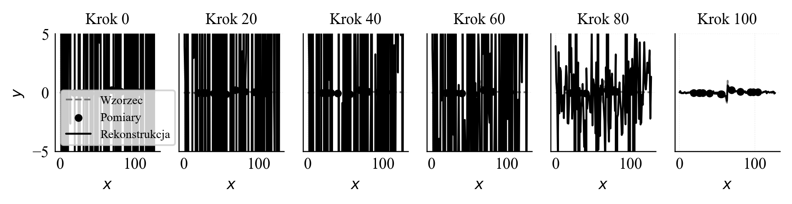
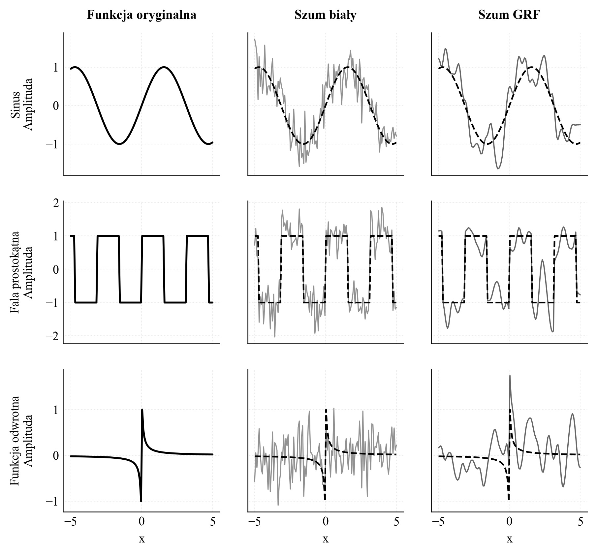
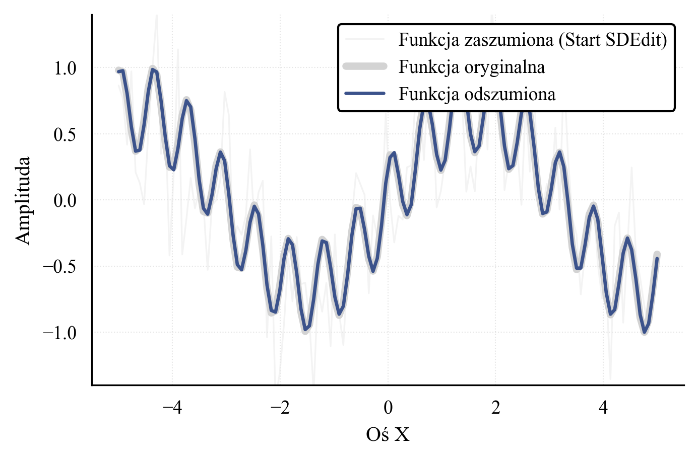
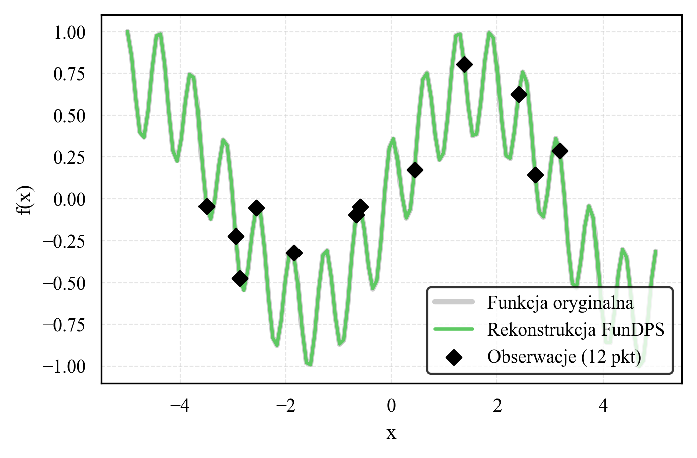

# Temat pracy magisterskiej: Zastosowanie modeli dyfuzyjnych do stabilizacji wykresów funkcji
**Autorka**: Klaudia Stodółkiewicz

**Promotor**: dr inż. Tomasz Służalec

Repozytorium stanowi część pracy magisterskiej poświęconej zastosowaniu modeli dyfuzyjnych do analizy, generacji oraz rekonstrukcji wykresów funkcji jednowymiarowych.

## Cel
Celem pracy magisterskiej jest szczegółowa analiza wpływu parametrów w modelach dyfuzyjnych na proces stabilizacji wykresów wybranych funkcji. 
W niniejszym repozytorium skupiono się na badaniu, w jaki sposób zmiana parametrów modelu - takich jak współczynnik dyfuzji, liczba iteracji czy metoda inicjalizacji procesu - wpływa na stabilność oraz dokładność uzyskiwanych wyników. Celem analizy jest sprawdzenie, czy istnieją optymalne zestawy parametrów prowadzących do redukcji szumów i poprawy precyzji odtwarzania funkcji, a co za tym idzie, stwierdzenie, czy modele dyfuzyjne (DDPM) oraz metody oparte o warunkowanie (SDEdit, FunDPS) są w stanie skutecznie rekonstruować zaszumione wykresy funkcji jednowymiarowych.

## Podstawy teoretyczne

### Modele dyfuzyjne (DDPM)

Denoising Diffusion Probabilistic Models (DDPM) to generatywne modele probabilistyczne, które uczą się rozkładu danych poprzez proces stopniowego dodawania szumu (proces forward - wykres 1) oraz jego odwracania (proces reverse - wykres 2) - sieć neuronowa uczy się usuwać szum i odzyskiwać oryginalny sygnał/wykres funkcji.
Model uczy się przybliżenia rozkładu danych poprzez minimalizację błędu rekonstrukcji szumu.



### SDEdit

SDEdit to metoda wykorzystująca modele dyfuzyjne do edycji oraz rekonstrukcji danych poprzez częściowe zaszumienie sygnału wejściowego/oryginalnej funkcji matematycznej i ich ponowne odtworzenie.

Charakterystyka:
* kontrolowany poziom degradacji danych,
* rekonstrukcja zgodna z wyuczonym rozkładem,
* zastosowanie w odszumianiu i inpaintingu.




### FunDPS

FunDPS (Function Diffusion Posterior Sampling) to metoda rozwiązująca problemy odwrotne poprzez warunkowanie procesu dyfuzyjnego.

Model optymalizuje:

* **prior** - wiedzę o rozkładzie funkcji,
* **likelihood** - zgodność z obserwacjami.

Tę metodę stosuje się głównie w rekonstrukcji funkcji z rzadkich próbek, inpaintingu oraz interpolacji.





## Rodzaje szumu

W eksperymentach wykorzystano dwa główne typy szumu:

### White Noise

* nieskorelowany szum Gaussowski,
* każda próbka niezależna,
* stosowany jako podstawowy model zakłóceń.

### Gaussian Random Field (GRF)

* szum skorelowany przestrzennie,
* modeluje realistyczne zakłócenia,
* generowany z wykorzystaniem funkcji kowariancji.




## Hiperparametry

Najważniejsze parametry wpływające na działanie modeli:

* **liczba kroków dyfuzji** - wpływa na dokładność i czas działania,
* **poziom szumu (noise level)** - kontroluje degradację sygnału,
* **zeta (ζ)** - siła warunkowania w FunDPS,
* **architektura modelu** - MLP / Conv1D / U-Net,
* **learning rate** - wpływa na proces uczenia.


## Eksperymenty

### 1. Pojemność architektur i zjawisko przeuczenia w modelach DDPM 1D

`01_pojemnosc_i_przeuczenie.ipynb`

* generacja funkcji 1D z DDPM,
* porównanie architektur: MLP, Conv1D, U-Net,
* analiza overfittingu i capacity modeli.


### 2. Odszumianie i rekonstrukcja metodą SDEdit.

`02_denoising_sdedit.ipynb`

* rekonstrukcja zaszumionych funkcji,
* analiza odporności modeli,
* wykorzystanie DDPM + SDEdit.


### 3. Warunkowa rekonstrukcja funkcji 1D z użyciem FunDPS

`03_denosing_fundps.ipynb`

* rekonstrukcja funkcji z niepełnych danych,
* analiza problemów odwrotnych,
* badanie wpływu:

  * rodzaju szumu (White vs GRF),
  * parametrów warunkowania.


## Wizualizacje

Pliki:

* `00_wprowadzenie_teoretyczne.ipynb`
* `tworzenie_wizualizacji.ipynb`

Zawierają:

* wpływ parametrów na proces dyfuzji,
* wizualizacje odszumiania,
* przykłady działania modeli.


## Struktura repozytorium

```
.
├── models/
│   ├── mlp.py
│   ├── conv1d.py
│   ├── unet.py
│   ├── ddpm1d.py
│   └── edm1d.py
│
├── utils/
│   ├── samplers.py
│   ├── metrics.py
│   └── visualisations.py
│
├── notebooks/
│   ├── 00_wprowadzenie_teoretyczne.ipynb
│   ├── 01_pojemnosc_i_przeuczenie.ipynb
│   ├── 02_denoising_sdedit.ipynb
│   ├── 03_denosing_fundps.ipynb
│   └── tworzenie_wizualizacji.ipynb
```


## Metryki

* **L2 Error** - podstawowa miara błędu rekonstrukcji,
* **MSE** - średni błąd kwadratowy,
* **czas wykonania** - wydajność obliczeniowa.


## Wnioski

* Modele dyfuzyjne skutecznie modelują rozkłady funkcji 1D,
* SDEdit umożliwia efektywne odszumianie,
* FunDPS jest najbardziej efektywną metodą w zadaniach rekonstrukcji,
* struktura szumu ma istotny wpływ na jakość wyników.


## Technologie

* Python
* PyTorch
* NumPy
* Matplotlib


## Uwagi

Repozytorium ma charakter badawczy i stanowi część pracy magisterskiej. Kod oraz eksperymenty zostały przygotowane w celach naukowych i eksperymentalnych.


## Instalacja i uruchomienie

```bash
git clone <REPO_URL>
cd <REPO_NAME>
pip install -r requirements.txt
```

### Uruchamianie środowiska

```bash
jupyter notebook
```


## Reprodukowalność wyników

1. **Trenowanie modeli (DDPM):**
   `01_pojemnosc_i_przeuczenie.ipynb`

2. **Odszumianie (SDEdit):**
   `02_denoising_sdedit.ipynb`

3. **Rekonstrukcja warunkowa (FunDPS):**
   `03_denosing_fundps.ipynb`

4. **Wizualizacje:**
   `00_wprowadzenie_teoretyczne.ipynb`
   `tworzenie_wizualizacji.ipynb`


## Dane

Dane wykorzystywane w eksperymentach są **syntetyczne** i generowane dynamicznie.

* źródło: `utils/samplers.py`
* typy funkcji:
  * wielomiany
  * funkcje trygonometryczne
  * funkcje wykładnicze i logarytmiczne
  * sygnały niestacjonarne (np. chirp)

### Przetwarzanie:
* normalizacja do wspólnego zakresu
* próbkowanie do stałej liczby punktów
* dodanie szumu (White / GRF)

## Podstawy matematyczne

### Proces dyfuzji (forward)

```math
q(x_t | x_{t-1}) = \mathcal{N}(x_t; \sqrt{1 - \beta_t} x_{t-1}, \beta_t I)
```

### Proces odwrotny (reverse)

```math
p_\theta(x_{t-1} | x_t)
```

### Funkcja straty

```math
\mathbb{E}_{x_0, \epsilon, t} \left[ || \epsilon - \epsilon_\theta(x_t, t) ||^2 \right]
```

### FunDPS (posterior sampling)

```math
\log p(x|y) \propto \log p(x) + \log p(y|x)
```

## Przykłady wyników

### DDPM vs. FunDPS
| Zdolność odszumiania (SDEdit) | Rekonstrukcja z 10% punktów pomiarowych (FunDPS) |
| :---: | :---: |
|  |  |


## Porównanie  SDEdit vs FunDPS

Oba algorytmy bazują na modelach dyfuzyjnych, jednak zostały zaprojektowane do rozwiązywania zupełnie odmiennych problemów numerycznych:

| Cecha potoku obliczeniowego | Metoda SDEdit (Eksperyment II) | Metoda FunDPS (Eksperyment III) |
| :--- | :--- | :--- |
| **Główny cel** | Globalne odszumianie i stabilizacja | Imputacja i rekonstrukcja z rzadkich danych |
| **Stan wejściowy** | Pełny sygnał ciągły z nałożonym szumem | Wybrakowany sygnał (np. tylko 10% znanych punktów) |
| **Najlepsza architektura** | Conv1D / U-Net 1D | U-Net 1D (wspierany nawigacją) |
| **Typowy błąd $L_2$** | 1.1% – 5.2% (zależnie od funkcji) | 0.18% – 2.5% (dla szumu białego) |
| **Średni czas operacji** | **0.003 s – 0.005 s** (Milisekundy) | **14.5 s – 14.7 s** (Sekundy) |
| **Najbardziej wpływowy parametr** | Harmonogram, skok solwera ($S$) oraz punkt startu ($R$) | Siła nawigacji gradientowej ($\zeta$) |

### Kiedy co wybrać?

* **SDEdit, gdy:** kompletny, ciągły przebieg fali, który jest silnie zakłócony szumem wysokoczęstotliwościowym. Dzięki czasowi przetwarzania na poziomie kilku milisekund (przy konfiguracji Conv1D, $T=80$, $S=2$ i harmonogramie liniowym), metoda ta idealnie nadaje się do systemów **pracujących w czasie rzeczywistym (real-time)**.
* **FunDPS, gdy:** układ rejestruje dane w sposób rzadki lub doszło do drastycznej utraty próbek (**nawet do 90% braków**). Algorytm z priorem opartym na szumie białym oraz siłą nawigacji $\zeta \in [2.0, 4.0]$ gwarantuje bezbłędne odtworzenie ciągłej geometrii fali. Ze względu na długi czas obliczeń (ok. 14 sekund) jest to rozwiązanie dedykowane do **analizy stacjonarnej**.

## Ograniczenia projektu

Opracowany potok obliczeniowy wykazuje kilka kluczowych ograniczeń metodologicznych i strukturalnych:

* **Izolowany i sztywny prior bezwarunkowy:** Proces uczenia sieci był prowadzony dla jednej, konkretnej funkcji na cały cykl. Model optymalny dla fali krokowej jest bezużyteczny dla funkcji wykładniczej. Każda zmiana badanej krzywej wymusza czasochłonne uczenie wag od zera, co ogranicza elastyczność systemu w warunkach zmiennych zadań.
* **Brak niezależności rozdzielczościowej:** Ponieważ modele dyfuzyjne operują bezpośrednio na wektorach o stałej długości, system jest zablokowany na sztywnej dyskretyzacji siatki. Algorytmy nie posiadają zdolności do ciągłej interpolacji – nie rekonstruują ciągłej przestrzeni funkcyjnej, a jedynie skończony zbiór punktów.
* **Statyczne sterowanie solwerem:** Parametry takie jak siła nawigacji ($\zeta$) czy punkt startu ($\tau$) są wprowadzane ręcznie jako wartości stałe. Brak dynamicznej pętli sprzężenia zwrotnego sprawia, że potok jest podatny na błędy konfiguracji i łatwo wpada w strefy niestabilności numerycznej (np. eksplozje gradientu wokół asymptot).

---

## Potencjalne zastosowania i rozwój

### Obszary wdrożeniowe
* Wykorzystanie FunDPS do szybkiego wygładzania i rekonstrukcji linii wykresów z wielogodzinnych symulacji na podstawie rzadkiego zestawu próbek (zamiast generowania tysięcy punktów metodą *brute force*).
* Alternatywa dla klasycznej metody najmniejszych kwadratów w laboratoriach pomiarowych, pozwalająca na odbudowę kompletnych funkcji z rozproszonych punktów z zachowaniem geometrycznych założeń o gładkości linii.
* Działanie jako stochastyczny filtr nakładający więzy ciągłości na rozwiązania trudnych równań różniczkowych zwyczajnych o nieznanej postaci analitycznej.

### Sugerowane kierunki badawcze
* Porzucenie modeli jednoukładowych na rzecz sieci dyfuzyjnych trenowanych na całych rodzinach funkcji jednocześnie, sterowanych wektorami cech (np. stopień wielomianu, częstotliwość).
* Zastąpienie konwolucji blokami samoatencji (*self-attention*), co pozwoli modelowi generatywnemu na jednoczesne wychwytywanie lokalnych załamań oraz globalnych trendów (okresowości, asymptot) na całej długości dziedziny.
* Ciągłe stochastyczne równania różniczkowe (SDE): Oparcie generacji na ciągłym modelowaniu bazującym na wynikach (*score matching*), co uniezależni proces odszumiania od sztywnej liczby kroków $T$.
* Ciągłe pola neuronowe (INR): Zastąpienie wektorów reprezentacją współrzędnościową w celu uzyskania całkowitej niezależności od rozdzielczości siatki wejściowej.


## Autorka

Klaudia Stodółkiewicz

*Zastosowanie modeli dyfuzyjnych do stabilizacji wykresów funkcji*

Informatyka - Data Science | Akademia Górniczo-Hutnicza im. Stanisława Staszica w Krakowie

2026


